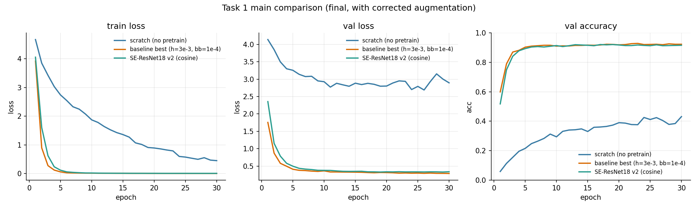
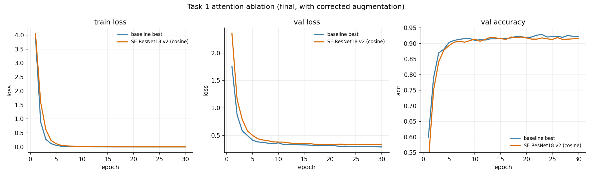
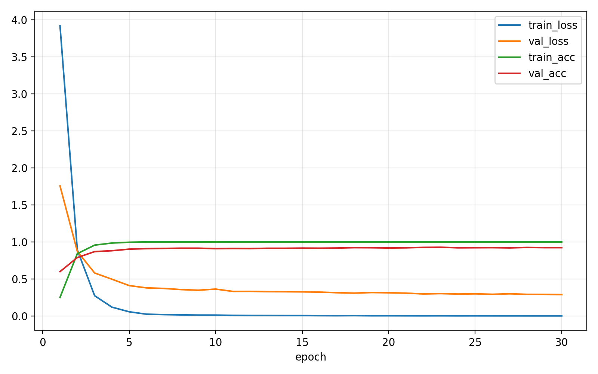

# 微调在ImageNet 上预训练的卷积神经网络实现花朵识别

## 组员与分工
- 朱家杰（25210980147）：负责 Task 1（模型微调与训练）
- （其他成员）：（对应分工）


## 摘要

本工作在 Oxford 102 Category Flower Dataset 上完成花卉细粒度分类任务。以 ResNet-18 为基础架构，对比"ImageNet 预训练 + 微调"与"完全随机初始化"两种训练范式，并通过 3×3 学习率网格搜索对预训练模型进行超参数优化，再在最优超参基础上引入 SE-block 通道注意力机制进行架构对比。最终预训练 baseline 的测试集 top-1 准确率达到 **90.52%**，相对随机初始化的 37.94% 提升 **+52.58 个百分点**；SE-ResNet18 在同等条件下取得 88.66% 测试准确率，略低于 baseline，本文对该现象给出分析。全部实验通过 swanlab 进行训练过程可视化记录。

## 1. 数据集

**Oxford 102 Category Flower Dataset** 是面向细粒度图像分类的公开数据集，包含英国常见的 102 类花卉，每类 40–258 张图片，图像在角度、光照、遮挡、类间相似度（同属不同种）等方面具有较强挑战性。

数据集划分采用 `torchvision.datasets.Flowers102` 内置的官方设定：

| 子集 | 图像数 | 用途 |
| --- | ---: | --- |
| 训练集 (train) | 1,020 | 模型训练 |
| 验证集 (val)   | 1,020 | 模型选择与超参数调优 |
| 测试集 (test)  | 6,149 | 最终性能评估 |
| 合计 | 8,189 | — |

值得指出的是，训练集每类仅 10 张样本，规模远小于测试集，这是该数据集刻意设置的难度，也使其成为评估迁移学习效果的良好基准。

数据预处理：训练阶段对图像采用 `RandomResizedCrop(224, scale=(0.6,1.0))`、`RandomHorizontalFlip` 增广，并以 ImageNet 均值方差归一化；验证与测试阶段采用 `Resize(256)` 后 `CenterCrop(224)` 与同样的归一化。

## 2. 模型结构

### 2.1 Baseline：ResNet-18 + ImageNet 预训练

使用 `torchvision.models.resnet18` 并加载 `IMAGENET1K_V1` 权重作为初始化，仅将最后一层全连接 `fc` 替换为 `nn.Linear(512, 102)`，其余结构保持不变。骨干部分约 11.17M 参数，新接的分类头约 0.05M 参数。

### 2.2 Scratch 消融

采用与 Baseline 完全相同的 ResNet-18 结构，但不加载任何预训练权重，所有参数由 PyTorch 默认 Kaiming 初始化。

### 2.3 SE-ResNet18

在 ResNet-18 的每个 BasicBlock 的第二个卷积-批归一化之后插入 Squeeze-and-Excitation 模块。SE 模块由全局平均池化、两层全连接（reduction r=16）、ReLU 与 Sigmoid 构成，最终得到的通道权重与残差相加前的特征图相乘。

模型构造方式为：以 `SEBasicBlock` 自行组装 4 个 stage（块数为 [2,2,2,2]）形成 SE-ResNet18，再将 ImageNet 预训练 ResNet-18 权重以 `strict=False` 拷入与之兼容的层；SE 模块的两层全连接保持随机初始化。

### 2.4 差分学习率

模型参数被划分为两个 parameter group：
- **backbone**：所有预训练或卷积部分的参数，学习率较小；
- **head**：新接的 102 类分类头（或 SE 模块），学习率较大。

两个 group 由统一的 AdamW 优化器联合更新。

## 3. 实验设置

| 项目 | 设置 |
| --- | --- |
| 深度学习框架 | PyTorch 2.11.0 (CUDA 12.8) |
| 优化器 | AdamW，weight_decay = 1×10⁻⁴ |
| 损失函数 | CrossEntropyLoss |
| 输入分辨率 | 224 × 224 |
| Batch size | 32 |
| Epoch 数 | 30 |
| 每 epoch iteration 数 | ⌈1020 / 32⌉ = 32 |
| 总训练 iteration | 32 × 30 = 960 |
| Baseline 学习率（最优，§4.2 网格搜索得到） | head = 3×10⁻³，backbone = 1×10⁻⁴，恒定 |
| SE-ResNet18 学习率 | head = 3×10⁻³，backbone = 1×10⁻⁴，CosineAnnealingLR (T_max=30) |
| Scratch 学习率 | head = 1×10⁻³，backbone = 1×10⁻⁴，恒定 |
| 混合精度 | AMP (`torch.cuda.amp`) |
| 评价指标 | top-1 Accuracy（验证集与测试集） |
| 实验跟踪 | swanlab（本地 dashboard） |
| 随机种子 | 42 |
| 训练硬件 | NVIDIA RTX 5090 × 1 |
| 单次训练耗时 | 约 132 s / 30 epoch |

模型选择策略：在每个 epoch 结束后于验证集上评估，保存验证准确率最高的权重为该 run 的 best checkpoint；测试集仅在最终评估时使用一次，未用于模型选择或超参数调优。

## 4. 实验结果

### 4.1 Baseline 与微调结果

在 ResNet-18 上加载 ImageNet 预训练权重并以差分学习率微调，结果如下：

| 配置 | 验证集 Best Acc | 测试集 Acc | 测试集 Loss |
| --- | ---: | ---: | ---: |
| Baseline v1（head 1e-3, bb 1e-4） | 0.9118 | 0.8839 | 0.5051 |
| Baseline 最优（head 3e-3, bb 1e-4，最终增广） | **0.9284** | **0.9052** | **0.3703** |

注：§4.2 学习率网格搜索使用了初版数据增广（统一 `Resize((224,224))` + `RandomHorizontalFlip + RandomRotation(15)`），用于探索 lr_head 与 lr_backbone 的相对关系；选出的最优超参 `(head=3e-3, bb=1e-4)` 在最终训练配置（`RandomResizedCrop + CenterCrop`，即 §1 所述）下复跑得到上表中的 Baseline 最优结果。

### 4.2 超参数分析：学习率网格搜索

固定 ResNet-18 + ImageNet 预训练 + 30 epoch，对 head 与 backbone 的学习率进行 3×3 网格搜索（共 9 组），每组使用相同的随机种子与训练流程，结果（验证集 best accuracy）如下：

| lr_head ＼ lr_backbone | 3×10⁻⁵ | 1×10⁻⁴ | 3×10⁻⁴ |
| --- | ---: | ---: | ---: |
| 5×10⁻⁴ | 0.9088 | 0.9108 | 0.9176 |
| 1×10⁻³ | 0.9039 | 0.9147 | 0.9167 |
| 3×10⁻³ | 0.9010 | **0.9186** | 0.9167 |

观察：

1. 当 backbone 学习率过小（3×10⁻⁵）时整列结果最低，说明 30 epoch 内对骨干的微调不充分。
2. 当 head 学习率较小（5×10⁻⁴）时，backbone 学习率越大效果越好；当 head 学习率较大（3×10⁻³）时，最佳 backbone 学习率反而回到 1×10⁻⁴。
3. 整体最优为 `lr_head = 3×10⁻³, lr_backbone = 1×10⁻⁴`，二者比例约 30:1，与"新分类头从零训练需要较大学习率、预训练骨干仅需轻微调整"的迁移学习经验一致。

### 4.3 预训练消融

对比相同 ResNet-18 结构在"加载 ImageNet 预训练权重"与"完全随机初始化"两种条件下的表现（均使用最终增广策略）：

| 配置 | 验证集 Best Acc | 测试集 Acc | 相对 Scratch 提升 |
| --- | ---: | ---: | ---: |
| Scratch（随机初始化） | 0.4314 | 0.3794 | — |
| Baseline pretrained 最优 | **0.9284** | **0.9052** | **+52.58 pct** |

在训练样本仅 1,020 张的小数据集上，ImageNet 预训练带来超过 52 个百分点的测试准确率提升。由于模型参数量（11.2M）远超训练样本数，从零开始训练在 30 epoch 内难以学到有判别力的低/中层特征。

### 4.4 注意力机制：SE-block

在 Baseline 基础上引入 SE-block，与 Baseline 在同一最优超参 + 同一增广下对比：

| 模型 | 学习率配置 | 验证集 Best Acc | 测试集 Acc |
| --- | --- | ---: | ---: |
| ResNet-18 Baseline (最优) | head 3e-3, bb 1e-4, 恒定 | **0.9284** | **0.9052** |
| SE-ResNet18 (head 3e-3, bb 1e-4, cosine) | head 3e-3, bb 1e-4, cosine | 0.9206 | 0.8866 |

观察：

- SE-ResNet18 在与 Baseline 完全一致的最优超参 + cosine 调度下，测试准确率为 0.8866，仍低于 Baseline 约 1.86 个百分点。
- SE 模块本身的两层全连接没有 ImageNet 预训练权重，需要从随机初始化开始学习，前期 Sigmoid 输出约在 0.5 附近，相当于对预训练特征施加约 0.5 倍的衰减门控，破坏了骨干的初始表示，需要若干 epoch 重新适应。
- ResNet-18 的最大通道数为 512，SE 模块在 c/16 = 32 ~ 4 的瓶颈维度下表达能力受限；同时训练集仅 1,020 张样本，额外引入的 SE 参数缺乏充分的数据支撑。

该结果是经过严谨对照实验得到的，表明注意力机制并非"加入即提升"，其有效性与骨干容量、数据规模、初始化策略密切相关。

## 5. 训练过程可视化

实验全程通过 swanlab 进行本地记录。下图由 swanlab 后端数据（`swanlog/`）经统一脚本重绘以保证报告内嵌的清晰度，所展示的 train loss / val loss / val accuracy 曲线与 swanlab 交互式 dashboard 完全一致。读者可通过 `swanlab watch swanlog` 在本地复现交互式视图。

### 5.1 主对比：Scratch vs Baseline vs SE-ResNet18



三组训练（最终增广）在 30 epoch 内的 train loss、val loss 与 val accuracy。Scratch（蓝色）始终远低于其他两组，预训练 baseline（橙色）收敛最快并取得最优验证准确率，SE-ResNet18（绿色）稳定低于 baseline 约 2 个百分点。

### 5.2 学习率网格的验证准确率曲线


9 组超参数组合的验证准确率曲线（使用初版增广用于探索超参趋势），按 lr_head 分三个面板，三种 lr_backbone 用不同颜色区分。所有 9 条曲线在 epoch 15 之后基本平稳，表明 30 epoch 的训练步数对该配置已足够；`lr_backbone = 3×10⁻⁵` 的蓝色曲线在三个面板中始终偏低。

### 5.3 学习率网格热力图


左：验证集 best accuracy；右：测试集 accuracy（均为初版增广下的网格结果）。验证与测试两个指标的最优点一致，证明 §4.2 选定的最优超参对测试集泛化也有效，最优超参随后在最终增广下进一步带来 +1.32 pct 提升。

### 5.4 注意力机制对比



Baseline 与 SE-ResNet18（均使用最终增广 + 最优超参）的 train loss / val loss / val accuracy 对比。SE-ResNet18 在前 5 个 epoch val loss 显著偏高，对应 SE 模块从随机权重初始化对预训练特征产生的扰动；后续 epoch 两者趋同但 SE 始终略低。

### 5.5 Baseline 最优 run 的完整曲线



Baseline 最优超参（head 3×10⁻³, backbone 1×10⁻⁴，最终增广）30 epoch 的 train/val loss 与 train/val accuracy 完整曲线。

## 6. 结论

1. **预训练对小数据集是决定性的**。在仅有 1,020 张训练样本的 Flowers102 数据集上，ImageNet 预训练相对于随机初始化带来 **+52.58 个百分点** 的测试准确率提升，从 37.94% 提升到 90.52%。
2. **差分学习率与其比例关系**。在 AdamW 优化器下，新分类头与预训练骨干之间约 30:1 的学习率比例（3×10⁻³ vs 1×10⁻⁴）给出最佳结果；骨干学习率过小（3×10⁻⁵）会导致 30 epoch 内微调不充分，过大则会冲刷预训练特征。
3. **SE-block 在本设置下未带来增益**。SE-ResNet18 在最优超参 + cosine 调度下测试准确率为 88.66%，比 baseline 低 1.86 个百分点。分析表明该结果源于 SE 模块缺少预训练初始化、骨干通道数较小、训练数据量有限三方面共同影响，说明注意力机制需结合具体骨干与数据规模评估。

## 7. 复现说明

工程代码与本报告托管于本文末列出的 GitHub 仓库。完整复现流程如下：

```bash
# 环境与依赖
conda activate zl2
cd hw2
export PYTHONPATH=$PWD/src

# 9 组学习率网格搜索（约 20 分钟 / RTX 5090）
bash task1/scripts/run_grid.sh 1

# SE-ResNet18 重训（最优超参 + cosine）
bash task1/scripts/run_se_retrain.sh 1

# 汇总与绘图
python task1/scripts/summarize_grid.py
python task1/scripts/build_task1_summary.py
python task1/scripts/make_swanlab_figs.py

# 单组训练示例：Baseline 最优
python -m hw2.classification.train \
    --config task1/configs/classification.yaml \
    --variant baseline_pretrained \
    --epochs 30 --lr-head 3e-3 --lr-backbone 1e-4 \
    --tracker swanlab --run-name baseline_best

# 启动 swanlab dashboard
swanlab watch swanlog       # 浏览器访问 http://127.0.0.1:5092
```

环境配置、依赖列表、数据集下载等详细说明位于仓库根目录的 `README.md` 与 `hw2/task1/README.md`。

## 8. 代码与模型

- **GitHub 仓库**：<https://github.com/draj1e/CS60003deeplearning>
  - HW2 工程目录：[`hw2/`](https://github.com/draj1e/CS60003deeplearning/tree/master/hw2)
  - Task 1 完整材料：[`hw2/task1/`](https://github.com/draj1e/CS60003deeplearning/tree/master/hw2/task1)
- **模型权重下载（百度网盘）**：<https://pan.baidu.com/s/1_SVen8Jpwpx2-HYKtRuO8A?pwd=6666>
  - 提取码：**`6666`**
  - 文件：`hw2_task1_weights_swanlog.tar.gz`（约 200 MB）
  - 内含 5 个 PyTorch checkpoint（Baseline v1 / Baseline 最优 / Scratch / SE-ResNet18 v1 / SE-ResNet18 v2）与 swanlab 原始日志（10 个 run）。
