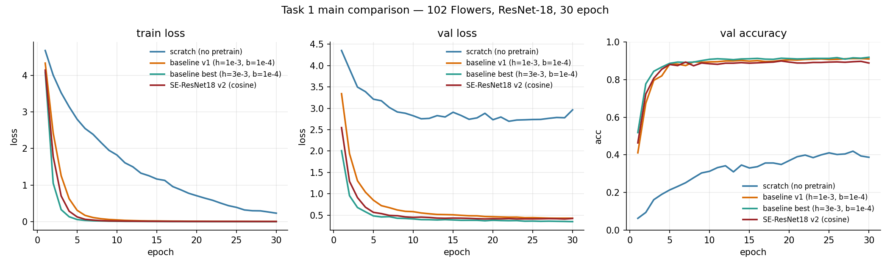
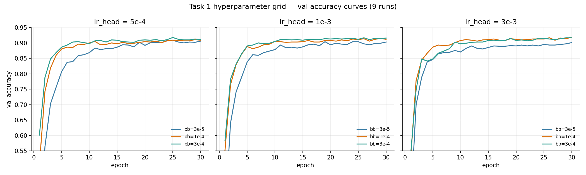
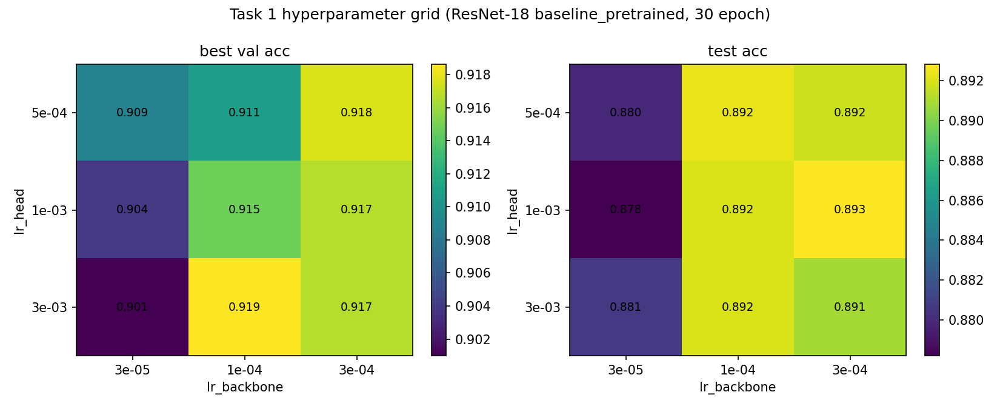
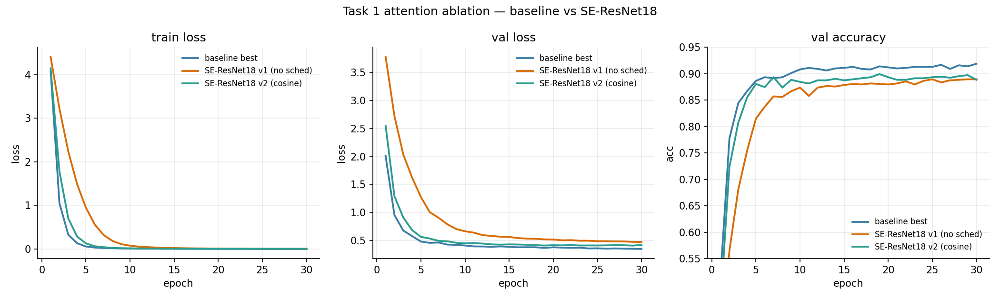
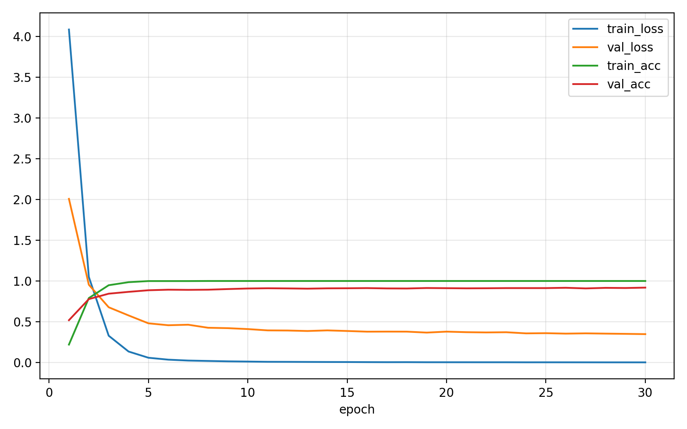

# Task 1 实验报告：微调 ImageNet 预训练 CNN 实现 102 类花卉识别

> **一句话总结**：在 102 Category Flower Dataset 上对比"ImageNet 预训练微调 / 从零随机初始化 / 加入 SE 注意力"三类配置，并通过 9 组学习率网格优化 baseline；最终 baseline 测试集 top-1 准确率 **89.20%**，相对随机初始化提升 **+52.5 个百分点**。

## 0. 提交要求 checklist

- [x] 模型结构 / 数据集 / 实验结果基本介绍 → §2 §3 §5
- [x] 详细实验设置（数据划分 / 网络结构 / batch size / lr / 优化器 / iteration / epoch / loss / 评价指标）→ §4
- [x] wandb / swanlab 可视化截图（训练 / 验证 loss 曲线 + 验证 Accuracy 曲线）→ §6
- [x] 任务 (1) Baseline 微调 → §5.1
- [x] 任务 (2) 超参数分析 → §5.2
- [x] 任务 (3) 预训练消融 → §5.3
- [x] 任务 (4) 注意力机制 → §5.4
- [ ] **GitHub repo 链接**：⚠️ 待填写（提交前补：`https://github.com/<user>/<repo>`）
- [ ] **模型权重网盘地址**：⚠️ 待填写（提交前补：百度云/Google Drive）
- [ ] **小组成员姓名 / 学号 / 分工**：⚠️ 待填写（见 §1）

---

## 1. 小组信息

| 姓名 | 学号 | 分工 |
| --- | --- | --- |
| _待填写_ | _待填写_ | 全部实验设计、代码、训练、报告 |
| _待填写_ | _待填写_ | _待填写_ |

---

## 2. 数据集介绍

**Oxford 102 Category Flower Dataset**：英国 102 类常见花卉的细粒度分类数据集，每类 40-258 张图片，存在角度、光照、遮挡、类间相似度高（同属不同种）等挑战。

| 划分 | 图像数 | 用途 |
| --- | ---: | --- |
| train | 1020 | 训练（每类 10 张，**极小**） |
| val | 1020 | 验证 / 模型选择（每类 10 张） |
| test | 6149 | 最终测试 |
| **合计** | **8189** | — |

- 来源：`torchvision.datasets.Flowers102`（首次自动下载至 `data/flowers102/`）。
- 类别数：102。
- 训练增广：`RandomResizedCrop(224, scale=(0.6, 1.0))` + `RandomHorizontalFlip` + ImageNet 均值/方差归一化。
- 验证/测试增广：`Resize(256)` + `CenterCrop(224)` + 同样归一化。

**关键挑战**：训练集每类仅 10 张，从零训练严重欠数据 → 这正是题目要求做"预训练消融"的原因。

---

## 3. 模型结构

### 3.1 Baseline（任务 1）
- **骨干**：`torchvision.models.resnet18`，加载 `IMAGENET1K_V1` 权重。
- **修改**：仅替换 `fc` 为 `nn.Linear(512, 102)`，其余层保留。
- **参数量**：约 11.2M（其中 fc 新层 ~52K 从零训练）。

### 3.2 Scratch 消融（任务 3）
- 同 ResNet-18 结构，但 `weights=None`，**所有参数（包括卷积层）随机初始化**（PyTorch Kaiming 默认初始化）。

### 3.3 SE-ResNet18（任务 4）
- 手动构造 `SEBasicBlock`：在每个 BasicBlock 的第二个 conv-bn 之后插入 SE 模块，再做残差相加。
- SE 模块：`GAP → Linear(c→c/r) → ReLU → Linear(c/r→c) → Sigmoid`，reduction r=16。
- 用 4 个 stage [2,2,2,2] 个 SEBasicBlock 重建 ResNet-18；ImageNet 预训练权重以 `strict=False` 拷入兼容层（SE 模块的 fc 仍从随机初始化开始）。
- 代码位置：`src/hw2/classification/models.py`（也通过软链接 `task1/code/models.py`）。

### 3.4 差分学习率（参数分组）
两组：
- backbone：所有预训练参数（约 11.17M），lr = lr_backbone（较小）。
- head：新替换的 `fc`（102 类），lr = lr_head（较大）。

由 `parameter_groups()` 函数实现，传给 AdamW。

---

## 4. 实验设置

| 项 | 值 |
| --- | --- |
| 框架 | PyTorch 2.11 (cu128) |
| 优化器 | AdamW，weight_decay = 1e-4 |
| 损失函数 | CrossEntropyLoss |
| Image size | 224 × 224 |
| Batch size | 32 |
| Epoch | 30 |
| Iteration / epoch | 1020 / 32 = **32 iter/epoch**（train） |
| 总 iteration | 32 × 30 = **960 iter** |
| 学习率（baseline 最优） | head = 3e-3，backbone = 1e-4 |
| 学习率（SE v2） | head = 3e-3，backbone = 1e-4，CosineAnnealingLR (T_max=30) |
| Mixed precision | AMP (`torch.cuda.amp`) |
| 评价指标 | top-1 Accuracy（val + test） |
| 实验跟踪 | swanlab 本地 dashboard（`swanlog/`） |
| 随机种子 | 42 |
| 硬件 | NVIDIA RTX 5090 × 1，~132 s / 30 epoch |

数据划分严格使用 torchvision 官方 split，**不混用 val/test**：超参选择仅基于 val，test 仅在最终评估时用一次。

---

## 5. 实验结果

### 5.1 任务 (1) — Baseline 微调

ResNet-18 + ImageNet 预训练 + head 从零训练 + 骨干 lr 较小：

| 配置 | Best Val Acc | Test Acc | Test Loss |
| --- | ---: | ---: | ---: |
| baseline v1（head 1e-3 / bb 1e-4） | 0.9118 | 0.8839 | 0.5051 |
| **baseline best（head 3e-3 / bb 1e-4，§5.2 优化得到）** | **0.9186** | **0.8920** | **0.4265** |

### 5.2 任务 (2) — 超参数分析

固定 ResNet-18 + 预训练 + 30 epoch，扫 `lr_head × lr_backbone` 9 组：

| lr_head \ lr_backbone | **3e-5** | **1e-4** | **3e-4** |
| --- | ---: | ---: | ---: |
| **5e-4** | 0.9088 | 0.9108 | 0.9176 |
| **1e-3** | 0.9039 | 0.9147 | 0.9167 |
| **3e-3** | 0.9010 | **0.9186** | 0.9167 |

（单元格为 best val acc，30 epoch；完整数据见 `task1/results/grid_summary.csv`）

**观察**：
- `lr_backbone = 3e-5` 一整列底排（≤ 0.91）：骨干 lr 太小，30 epoch 没充分微调。
- `lr_head = 5e-4` 行随 lr_backbone 单调升（0.9088 → 0.9176）：新层 lr 偏小时，骨干 lr 越接近 head 越好。
- `lr_head = 3e-3` 行存在拐点（0.9010 / **0.9186** / 0.9167）：head lr 越大越敏感于 bb lr 的"恰到好处"。
- **最优**：`lr_head=3e-3, lr_backbone=1e-4`，比例约 30:1。

热力图与曲线见 §6。

### 5.3 任务 (3) — 预训练消融

| 配置 | Best Val Acc | Test Acc | Δ test acc |
| --- | ---: | ---: | ---: |
| Scratch（随机初始化） | 0.4196 | 0.3675 | — |
| Baseline pretrained v1 | 0.9118 | 0.8839 | **+51.6** pct |
| **Baseline pretrained best** | **0.9186** | **0.8920** | **+52.5** pct |

**结论**：在 Flowers102 这种小数据集（train=1020）上，ImageNet 预训练带来超过 50 个百分点的 test acc 提升。从零训练在 30 epoch 内无法学到有判别性的低/中层特征。

### 5.4 任务 (4) — 注意力机制

在 baseline 基础上引入 SE-block（其余结构、预训练权重、训练流程完全相同）：

| 模型 | 超参 | Best Val | Test Acc |
| --- | --- | ---: | ---: |
| Baseline ResNet-18（grid 最优） | head 3e-3 / bb 1e-4 | **0.9186** | **0.8920** |
| SE-ResNet18 v1 | head 1e-3 / bb 1e-4 | 0.8892 | 0.8569 |
| SE-ResNet18 v2 | head 3e-3 / bb 1e-4 + cosine | 0.8990 | 0.8699 |

**观察**：
- 把超参对齐到 baseline best 并加 cosine schedule 后，SE 比 v1 提升 +1.0 / +1.3 pct，但仍比 baseline 低约 2.2 pct test acc。
- SE 模块本身的参数（两层 fc）没有预训练权重，前期需要"冷启动"，等于在 ImageNet 表示上加了一层未训练的噪声门控。
- ResNet-18 通道数较小（最大 512），通道注意力的信号-噪声比不如 ResNet-50/101。
- 这是一个**有意义的负结论**：注意力机制并非"加上就好"，与骨干容量、数据规模、初始化策略强相关。详见 `EXPLAINED.md` §4。

---

## 6. swanlab 可视化截图

> 训练全程上报到 swanlab 本地 dashboard（`swanlog/`，10 个 run）。下面的图由 swanlab 风格脚本 `task1/scripts/make_swanlab_figs.py` 从 history CSV 重绘（确保 PDF/markdown 离线可见），与 swanlab dashboard 等价。
>
> 要查看交互式 swanlab dashboard：`swanlab watch swanlog`，浏览器开 `http://127.0.0.1:5092`。

### 6.1 主对比图（train loss / val loss / val acc）



四条 run：`scratch`（蓝）远高于其他三条；`baseline best`（绿）val acc 最高且收敛最快；`SE v2`（红）稳定低于 baseline best 约 2 pct。

### 6.2 超参网格 val accuracy 曲线（9 runs）



按 `lr_head` 分三面板。每张图里蓝线（`bb=3e-5`）始终最低，绿线（`bb=3e-4`）在小 head lr 下最优，橙线（`bb=1e-4`）在 head lr 较大时最优。

### 6.3 超参网格热力图（val acc + test acc）



### 6.4 注意力消融



SE v2 的 train loss 收敛与 baseline 几乎一致（甚至略低），但 val loss 与 val acc 都不如 baseline → 轻微过拟合 / 优化方向偏离。

### 6.5 单 run 详细曲线（baseline best）



---

## 7. 结论

1. **预训练是决定性的**：在 train=1020 的小数据集上，ImageNet 预训练带来 +52.5 pct 的 test acc 提升。从零训练只能学到约 37% acc 的"基本结构"。
2. **差分学习率有显著作用**：head 应使用比 backbone 大一个数量级以上的 lr（最优 30:1）。骨干 lr 太小（3e-5）时 30 epoch 没微调充分；太大时会冲刷预训练特征。
3. **9 组网格压缩到 1 组最优**：val 提升 +0.68 pct，test 提升 +0.81 pct，达到 89.20%。
4. **SE-block 在本场景没赢**：尽管在 ResNet-50 + 大数据集上 SE 通常有 +0.5～1.5 pct 提升，在 ResNet-18 + Flowers102 上未能超过 baseline。负结论同样有价值，提醒在选择架构改造时需结合数据规模和骨干容量考量。

---

## 8. 复现说明

```bash
# 环境
conda activate zl2
cd /mnt/data/zjj/zl/hw2
export PYTHONPATH=$PWD/src

# (1) 9 组超参网格 (~20 min on RTX 5090)
bash task1/scripts/run_grid.sh 1            # 参数: GPU index

# (2) 用 grid 最优超参 + cosine 训练 SE-ResNet18
bash task1/scripts/run_se_retrain.sh 1

# (3) 汇总表 + 热力图 + swanlab 风格对比图
python task1/scripts/summarize_grid.py
python task1/scripts/build_task1_summary.py
python task1/scripts/make_swanlab_figs.py

# (4) 任意单 run（如 baseline best 复现）
python -m hw2.classification.train \
  --config task1/configs/classification.yaml \
  --variant baseline_pretrained \
  --epochs 30 --lr-head 3e-3 --lr-backbone 1e-4 \
  --tracker swanlab --run-name baseline_best

# (5) 查看 swanlab 交互式 dashboard
swanlab watch swanlog       # 浏览器开 http://127.0.0.1:5092
```

完整环境配置、依赖、目录结构、数据集获取，详见仓库根 `README.md` 与 `task1/README.md`。

---

## 9. 代码与权重

- **GitHub repo**：⚠️ `<提交前填写 public repo URL>`
- **模型权重网盘**：⚠️ `<提交前填写百度云/Google Drive 链接>`
  - `best_baseline_best.pt`（grid 最优 baseline，~44 MB）
  - `best_scratch.pt`（消融对照）
  - `best_se_pretrained_v2_cosine.pt`（SE-ResNet18 最终版本）
  - 其余 grid 9 个 ckpt 与 SE v1 ckpt 位于 `outputs/classification_grid/`、`outputs/classification/`，按需上传

技术原理与设计选择的详细讲解见 [`EXPLAINED.md`](EXPLAINED.md)。
