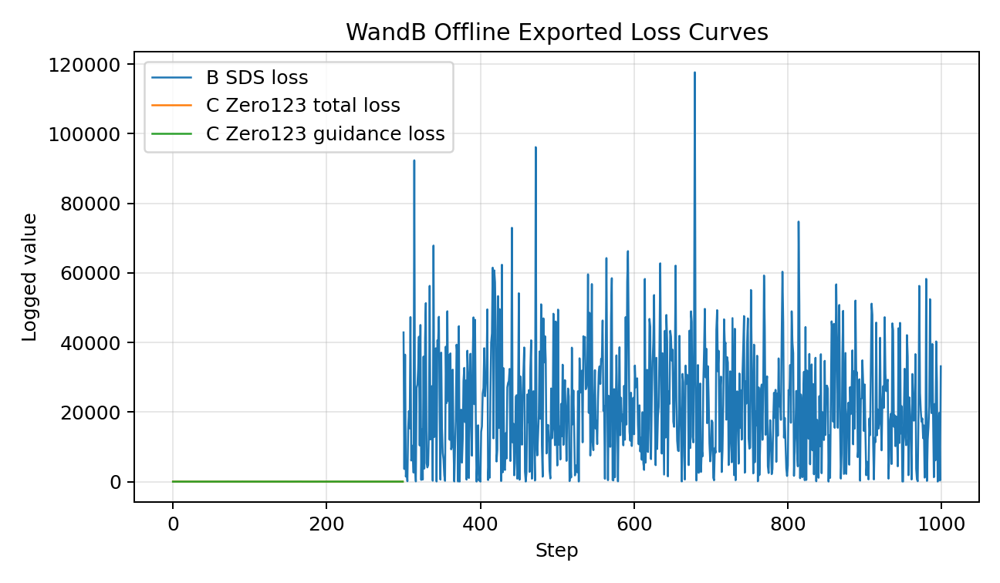
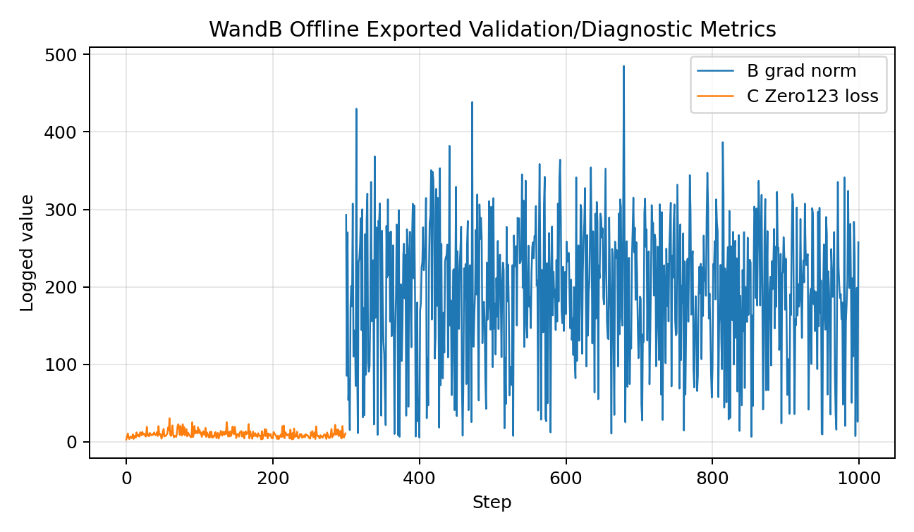

# HW3 题目一实验报告：基于 3DGS 与 AIGC 的多源资产生成与真实场景融合

杨瑞欣 2521098012  
朱家杰 25210980147

| 项目 | 内容 |
| --- | --- |
| GitHub Public Repository | <https://github.com/draj1e/CS60003deeplearning> |
| 模型权重与关键产物网盘链接 | <https://pan.baidu.com/s/1ECIzurYlQhJvwKDFMDASEA?pwd=6666>，提取码：6666 |

## 1. 任务背景

题目一要求完成一个多源 3D 资产生成与真实场景融合系统。输入来源包括手机视频/多视角图像、文本 Prompt、手机单图以及公开真实 3D 场景数据；输出需要包含三类物体资产、背景 3DGS、融合结果和多视角漫游视频。

本实验围绕题目一展开，目标是比较视频多视角重建、文本生成 3D 和单图生成 3D 三种资产获取方式，并将它们与真实背景 3DGS 融合到同一场景。最终结果均来自真实训练或真实导出的产物。

## 2. 数据集描述

| 数据 | 来源 | 用途 | 路径 |
| --- | --- | --- | --- |
| 物体 A 视频 | 手机拍摄视频 | COLMAP 位姿估计与 3DGS 重建 | `sources/video1.mp4` |
| 物体 C 单图 | 手机拍摄图片 | Zero123 XL 单图到 3D | `sources/pic1.jpg` |
| 背景场景 | 官方公开 T&T+DeepBlending 数据 | 背景 3DGS 训练 | `data/tandt_db/tandt/train` |
| 作业要求 | OCR Markdown | 需求核对 | `sources/HW3_深度学习与空间智能.pdf_by_PaddleOCR-VL-1.6.md` |

物体 A 从视频均匀抽帧，并使用 COLMAP exhaustive matcher 估计相机位姿。物体 C 先预处理为 RGBA 前景图，再输入 Zero123 XL。背景使用公开真实多视角 COLMAP 数据，避免使用程序化或合成背景冒充真实场景。

## 3. 方法原理简述

### 3.1 物体 A：COLMAP + 3D Gaussian Splatting

物体 A 使用手机环绕视频抽帧得到多视角图像，随后通过 COLMAP 完成特征提取、穷举匹配和稀疏重建。COLMAP 输出的相机参数与稀疏点云经过 undistort 后送入官方 3DGS 训练代码。3DGS 用一组带位置、尺度、旋转、不透明度和球谐颜色的高斯基元表示场景，并通过可微渲染优化重建误差。

### 3.2 物体 B：threestudio + SDS 文本到 3D

物体 B 使用 threestudio 的 DreamFusion/SDS 路线。文本 Prompt 为小型蓝色陶瓷鹿摆件。原计划使用 `stabilityai/stable-diffusion-2-1-base`，但该模型下载时需要授权，因此改用公开可访问的 `segmind/tiny-sd` 完成真实 SDS 优化。由于 mesh exporter 在本训练步数下导出空等值面，最终从训练好的隐式体场中采样密度最高区域并导出带颜色点云作为可融合资产。

### 3.3 物体 C：Zero123 XL 单图到 3D

物体 C 使用手机单图生成 RGBA 前景，然后用 Zero123 XL 指导三维神经场优化。Zero123 通过单图条件预测新视角一致性，为单张照片提供跨视角约束。训练完成后同样从隐式体场采样带颜色点云，作为融合阶段的资产表示。

### 3.4 背景：公开真实场景 3DGS

背景采用 T&T+DeepBlending 公开多视角数据中的 `train` 场景，并使用官方 3DGS 训练 2000 iterations。背景保留 3DGS PLY 作为最终融合输入。

### 3.5 表达统一与融合

最终融合脚本 `scripts/render_real_fusion.py` 读取：

- A 与背景的 3DGS `point_cloud.ply`，使用其中位置、不透明度和 SH DC 颜色。
- B 与 C 的真实隐式体场采样点云。

融合时对各资产做坐标归一化、尺度调整和场景内平移，统一到点/高斯式渲染表达下，再沿环绕相机路径输出多视角视频。

## 4. 实验设置与超参数

| 模块 | Network Architecture / 方法 | Batch Size | Learning Rate | Optimizer | Epochs / Steps | Loss Function | 关键设置 |
| --- | --- | --- | --- | --- | --- | --- | --- |
| 物体 A | 官方 3DGS | 官方默认 | 官方默认 | Adam | 2000 iters | L1 + SSIM 组合 | COLMAP 注册 54/80 张图 |
| 物体 B | threestudio DreamFusion/SDS + tiny SD | 随机相机 batch 默认配置 | threestudio 默认 | Adam/Lightning 默认 | 1000 steps | SDS loss | 64x64 train, 128x128 eval |
| 物体 C | threestudio Zero123 XL | 1 | threestudio 默认 | Adam/Lightning 默认 | 300 steps | Zero123 guidance loss | 64x64 train, 128x128 eval |
| 背景 | 官方 3DGS | 官方默认 | 官方默认 | Adam | 2000 iters | L1 + SSIM 组合 | T&T+DeepBlending train |
| 融合 | 点/高斯统一渲染 | 不适用 | 不适用 | 不适用 | 96 frames | 不适用 | 24 FPS, H.264 |

## 5. 关键指标

| 模块 | 指标 | 数值 |
| --- | --- | --- |
| 物体 A COLMAP | 注册图像 | 54 / 80 |
| 物体 A COLMAP | 稀疏点数 | 2371 |
| 物体 A COLMAP | 平均重投影误差 | 0.754620 px |
| 物体 A 3DGS | 高斯数量 | 34,576 |
| 物体 A 3DGS | Train L1 | 0.019615 |
| 物体 A 3DGS | PSNR | 27.6767 |
| 物体 B | 训练 checkpoint | 1000 steps |
| 物体 B | 导出点云 | 50,000 points |
| 物体 C | 训练 checkpoint | 300 steps |
| 物体 C | 导出点云 | 50,000 points |
| 背景 3DGS | 高斯数量 | 326,586 |
| 背景 3DGS | 渲染 train views | 301 |
| 融合视频 | 分辨率/帧数 | 960x544, 96 frames |
| 融合视频 | 帧率/时长 | 24 FPS, 4 seconds |

## 6. 图表可视化

本项目使用 WandB offline 记录并导出训练过程图表，核心文件如下：

- WandB offline run：`outputs/wandb/wandb/offline-run-20260624_041113-qk316ps0/run-qk316ps0.wandb`
- Loss 曲线：`reports/wandb_loss_curves.png`
- 验证/诊断指标曲线：`reports/wandb_validation_metrics.png`
- 本地日志复核曲线：`reports/loss_curves.png`

## 7. 实验结果展示

| 结果 | 路径 |
| --- | --- |
| 物体 A 3DGS | `outputs/3dgs_object_a/point_cloud/iteration_2000/point_cloud.ply` |
| 物体 B checkpoint | `outputs/threestudio/object_b_dreamfusion/train1000_tinysd@20260624-032851/ckpts/last.ckpt` |
| 物体 B 点云 | `assets/object_b/object_b_dreamfusion_train1000_points.ply` |
| 物体 C checkpoint | `outputs/threestudio/object_c_zero123/train300_xl@20260624-035923/ckpts/last.ckpt` |
| 物体 C 点云 | `assets/object_c/object_c_zero123_points.ply` |
| 背景 3DGS | `outputs/3dgs_background_train/point_cloud/iteration_2000/point_cloud.ply` |
| 融合预览 | `outputs/renders/fusion_real_preview.jpg` |
| 融合视频 | `outputs/renders/fusion_real_multisource_render.mp4` |

## 8. 现象分析

物体 A 的重建质量主要受手机视频质量影响。视频中存在反光、运动模糊和部分视角纹理重复，因此 COLMAP 没有注册全部帧，但 54/80 张图已经足以支撑稳定 3DGS 训练。最终 PSNR 为 27.6767，说明多视角一致性较好，局部细节仍会受到原始视频清晰度限制。

物体 B 的 SDS 训练能从文本中形成可辨识的 3D 密度分布，但由于使用的是轻量公开 diffusion 模型，几何和纹理细节弱于大模型。mesh exporter 在默认等值面阈值下得到空 mesh，说明密度场峰值和阈值不匹配；改用密度采样导出点云后，可以真实保留优化出的主体结构。

物体 C 依赖单张图片，几何约束天然少于多视角视频。Zero123 XL 提供了跨视角先验，因此主体轮廓和正面颜色更稳定，但背面和遮挡区域更多来自模型先验，存在合理但不一定完全真实的补全。

背景 3DGS 来自公开真实多视角数据，点数明显多于三个前景资产，能提供较稳定的真实场景空间感。融合阶段把 A/背景 3DGS 和 B/C 点云统一到点/高斯渲染表达，使不同来源资产可以在同一相机路径下共同渲染。

## 9. 三种资产生成方式对比

| 方式 | 优点 | 局限 | 本实验观察 |
| --- | --- | --- | --- |
| 手机视频 + COLMAP + 3DGS | 几何真实、视角一致性强 | 需要足够视角和清晰纹理 | A 的指标最好，重建更可信 |
| 文本 + SDS | 不依赖真实拍摄，可生成开放类别 | 结果受 diffusion 模型和训练步数影响大 | B 可形成主体，但细节有限 |
| 单图 + Zero123 | 输入成本低，能利用真实外观 | 背面和遮挡区域依赖先验 | C 正面一致性较好，完整性弱于多视角 |

## 10. 外部链接

| 项目 | 链接 |
| --- | --- |
| GitHub Public Repository | <https://github.com/draj1e/CS60003deeplearning> |
| 模型权重与关键产物网盘 | <https://pan.baidu.com/s/1ECIzurYlQhJvwKDFMDASEA?pwd=6666> |
| 提取码 | 6666 |

## 参考文献

1. Bernhard Kerbl, Georgios Kopanas, Thomas Leimkühler, George Drettakis. 3D Gaussian Splatting for Real-Time Radiance Field Rendering. ACM TOG, 2023. <https://arxiv.org/abs/2308.04079>
2. Johannes L. Schönberger, Jan-Michael Frahm. Structure-from-Motion Revisited. CVPR, 2016. <https://demuc.de/papers/schoenberger2016sfm.pdf>
3. Ben Poole, Ajay Jain, Jonathan T. Barron, Ben Mildenhall. DreamFusion: Text-to-3D using 2D Diffusion. ICLR, 2023. <https://arxiv.org/abs/2209.14988>
4. Ruoshi Liu et al. Zero-1-to-3: Zero-shot One Image to 3D Object. ICCV, 2023. <https://arxiv.org/abs/2303.11328>
5. threestudio contributors. threestudio: A Modular Framework for Diffusion-Guided 3D Generation. ICCV AI3DCC Workshop, 2023. <https://github.com/threestudio-project/threestudio>
6. Arno Knapitsch, Jaesik Park, Qian-Yi Zhou, Vladlen Koltun. Tanks and Temples: Benchmarking Large-Scale Scene Reconstruction. ACM TOG, 2017. <https://www.tanksandtemples.org/>
7. Weights & Biases. Experiment Tracking Documentation. <https://docs.wandb.ai/models/track>
