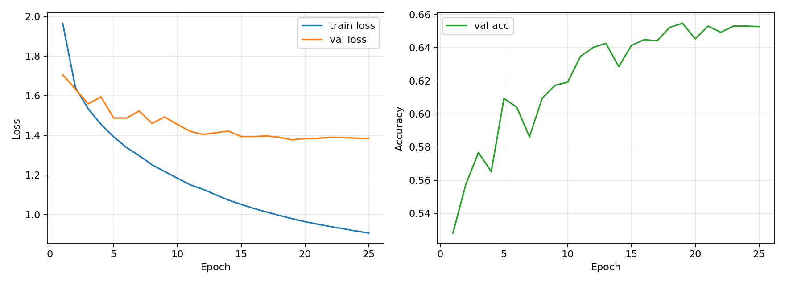
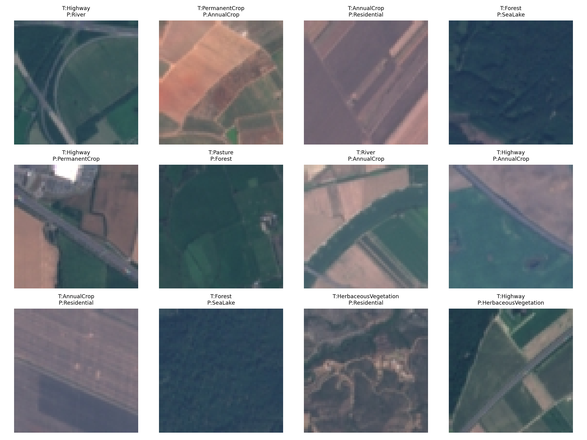

# EuroSAT 地表覆盖分类实验报告
## HW1：从零开始构建三层神经网络分类器

---

## 一、实验方案梳理

### 1.1 任务目标

本实验要求在遥感图像数据集 **EuroSAT_RGB** 上，手工搭建三层神经网络（MLP）分类器，实现土地覆盖图像十分类。数据集中每张图像为 RGB 卫星遥感图像，类别包括森林、河流、高速公路、住宅区、工业区、农田、水体等典型地表覆盖类型。

本实验严格遵守作业限制：**不使用 PyTorch、TensorFlow、JAX 等自动微分深度学习框架**，仅使用 NumPy 进行矩阵运算，并手写前向传播、交叉熵损失、反向传播梯度、SGD 更新、学习率衰减和 L2 正则化。

### 1.2 数据集处理流程

数据读取与预处理模块位于 `src/data.py`。处理流程如下：

| 步骤 | 具体做法 |
|------|----------|
| 数据读取 | 从 `EuroSAT_RGB/<class_name>/*.jpg` 中按类别读取图像 |
| 类别数量 | 10 类：AnnualCrop、Forest、HerbaceousVegetation、Highway、Industrial、Pasture、PermanentCrop、Residential、River、SeaLake |
| 图像格式 | 使用 Pillow 读取并统一转换为 RGB |
| 图像尺寸 | 默认使用 `64 × 64 × 3` |
| 输入表示 | 将图像展平为 `12288` 维向量输入 MLP |
| 归一化 | 像素值缩放到 `[0, 1]` |
| 标准化 | 使用训练集均值和标准差，对训练/验证/测试集统一标准化 |
| 数据划分 | 按类别分层划分为 70% 训练集、15% 验证集、15% 测试集 |

分层划分可以保证每个类别在训练集、验证集和测试集中都有相近比例，避免类别分布偏移影响模型选择。验证集只用于选择最佳模型和超参数，测试集只用于最终评估。

### 1.3 模型结构

模型定义位于 `src/model.py`。本实验实现的是三层全连接 MLP：

```text
Input(12288) -> Linear(256) -> ReLU -> Linear(128) -> ReLU -> Linear(10) -> Softmax
```

模型支持自定义隐藏层维度，例如 `128,64` 或 `256,128`；同时支持多种激活函数切换，包括 `ReLU`、`Sigmoid` 和 `Tanh`。最终正式实验采用验证集表现最好的配置：`256,128` 两层隐藏维度和 ReLU 激活函数。

模型输出为 10 维 logits，经 Softmax 得到类别概率。训练目标为 Softmax Cross-Entropy Loss，并对三层权重矩阵加入 L2 正则项：

```text
Loss = CrossEntropy(y, p) + 0.5 * weight_decay * Σ||W_i||²
```

反向传播完全手写实现，依次计算输出层、第二隐藏层、第一隐藏层的梯度，并将 L2 正则梯度加到权重梯度中。

### 1.4 训练与模型选择

训练循环位于 `src/train.py`，优化器位于 `src/optim.py`。训练策略如下：

- **优化器**：SGD
- **学习率衰减**：每个 epoch 后按 `lr_t = lr_0 × decay^(epoch-1)` 计算当前学习率
- **正则化**：L2 Weight Decay
- **模型选择**：每个 epoch 后在验证集上评估 Accuracy，若验证集 Accuracy 超过历史最佳，则自动保存当前权重
- **训练记录**：保存每轮训练/验证 Loss、训练/验证 Accuracy、当前学习率

最终最优模型权重保存在：

```text
outputs/models/final_h256_128_lr001_wd001_relu_best.npz
```

### 1.5 超参数搜索设置

超参数搜索入口为 `search.py`，采用网格搜索。搜索维度如下：

| 维度 | 搜索范围 |
|------|----------|
| Hidden Dimension | `128,64`、`256,128` |
| Learning Rate | `0.05`、`0.01` |
| Weight Decay | `0.0001`、`0.001` |
| Activation | ReLU |

每组配置训练 8 个 epoch，并记录验证集最佳 Accuracy。搜索结果保存于：

```text
outputs/search/search_results.csv
outputs/search/search_results.json
```

---

## 二、核心结果对比

### 2.1 超参数搜索结果

| 实验 | Hidden Dims | Learning Rate | Weight Decay | Activation | Best Val Acc |
|------|-------------|---------------|--------------|------------|--------------|
| Search-1 | 128 / 64 | 0.05 | 0.0001 | ReLU | 35.58% |
| Search-2 | 128 / 64 | 0.05 | 0.001 | ReLU | 36.27% |
| Search-3 | 128 / 64 | 0.01 | 0.0001 | ReLU | 61.28% |
| Search-4 | 128 / 64 | 0.01 | 0.001 | ReLU | 59.78% |
| Search-5 | 256 / 128 | 0.05 | 0.0001 | ReLU | 11.26% |
| Search-6 | 256 / 128 | 0.05 | 0.001 | ReLU | 51.60% |
| Search-7 | 256 / 128 | 0.01 | 0.0001 | ReLU | 61.98% |
| **Search-8** | **256 / 128** | **0.01** | **0.001** | **ReLU** | **62.99%** |

> 搜索结果表明，学习率对训练稳定性影响明显。`lr=0.05` 在较大隐藏层下容易导致训练不稳定或收敛较差，而 `lr=0.01` 更稳定。最终选择 `hidden_dims=256,128`、`lr=0.01`、`weight_decay=0.001`、`activation=ReLU` 作为正式训练配置。

### 2.2 正式训练结果

正式训练使用 Search-8 的最佳配置，并将训练轮数增加到 25 个 epoch。最佳模型出现在第 19 个 epoch：

| Epoch | LR | Train Loss | Val Loss | Train Acc | Val Acc |
|------|----|------------|----------|-----------|---------|
| 19 | 0.003972 | 0.9808 | 1.3778 | 82.28% | **65.48%** |
| 25 | 0.002920 | 0.9084 | 1.3854 | 84.27% | 65.28% |

可以看到，训练集准确率在后期仍持续上升，而验证集准确率在第 19 个 epoch 后基本进入平台期，说明模型开始出现一定程度过拟合。因此最终使用第 19 个 epoch 自动保存的最佳验证模型进行测试集评估。

### 2.3 训练过程可视化

下图展示了训练过程中训练集 Loss、验证集 Loss 以及验证集 Accuracy 的变化曲线：



对应图片文件为：

```text
outputs/figures/final_h256_128_lr001_wd001_relu_curves.png
```

**曲线分析：**

1. **训练 Loss 持续下降**：说明手写反向传播和 SGD 更新有效，模型能够逐步拟合训练集。
2. **验证 Loss 前期下降、后期趋于平稳**：第 19 个 epoch 附近验证表现最佳，之后继续训练对验证集收益不大。
3. **验证 Accuracy 上升后进入平台期**：最终最佳验证准确率为 65.48%，表明 MLP 可以学习到一定的颜色与全局纹理特征，但受限于展平输入，空间结构建模能力不足。
4. **训练/验证差距逐渐增大**：后期训练 Accuracy 高于验证 Accuracy，说明模型存在一定过拟合现象。

### 2.4 测试集结果与混淆矩阵

加载验证集上表现最好的权重，在独立测试集上得到：

| 指标 | 数值 |
|------|------|
| Test Accuracy | **65.04%** |

混淆矩阵如下，行表示真实类别，列表示预测类别：

| True \ Pred | AnnualCrop | Forest | HerbaceousVegetation | Highway | Industrial | Pasture | PermanentCrop | Residential | River | SeaLake |
|-------------|------------|--------|----------------------|---------|------------|---------|---------------|-------------|-------|---------|
| AnnualCrop | 292 | 2 | 24 | 21 | 7 | 8 | 51 | 17 | 21 | 7 |
| Forest | 0 | 375 | 7 | 1 | 0 | 18 | 0 | 0 | 1 | 48 |
| HerbaceousVegetation | 43 | 7 | 231 | 36 | 3 | 6 | 60 | 42 | 14 | 8 |
| Highway | 39 | 2 | 24 | 139 | 11 | 13 | 30 | 43 | 68 | 6 |
| Industrial | 7 | 0 | 1 | 17 | 304 | 0 | 2 | 39 | 5 | 0 |
| Pasture | 4 | 20 | 18 | 2 | 0 | 227 | 4 | 3 | 20 | 2 |
| PermanentCrop | 66 | 3 | 41 | 20 | 11 | 13 | 174 | 22 | 24 | 1 |
| Residential | 9 | 0 | 31 | 40 | 40 | 1 | 17 | 286 | 24 | 2 |
| River | 22 | 11 | 11 | 45 | 4 | 16 | 4 | 7 | 246 | 9 |
| SeaLake | 4 | 36 | 4 | 0 | 1 | 14 | 1 | 13 | 17 | 360 |

**结果分析：**

1. Forest、Industrial、Residential、SeaLake 等类别分类效果较好，说明这些类别具有较明显的颜色或纹理统计特征。
2. AnnualCrop、PermanentCrop、HerbaceousVegetation、Pasture 等植被/农业类之间混淆较多，因为它们在 RGB 图像上都可能呈现绿色、黄色或规则纹理。
3. Highway 和 River 之间存在明显混淆，例如 Highway 被预测成 River 的样本有 68 个。这说明 MLP 对细长线状结构的语义区分能力有限。
4. 由于 MLP 直接展平图像，缺少卷积网络的局部感受野和平移不变性，因此对空间结构相近的类别区分不如 CNN 稳定。

---

## 三、权重可视化与 Bad Case 分析

### 3.1 第一层权重可视化

作业要求将训练好的第一层隐藏层权重矩阵恢复成图像尺寸并可视化。本实验将第一层权重 `W1` 的列向量恢复为 `64 × 64 × 3` 图像，并展示部分隐藏单元的权重模式：


对应图片文件为：

```text
outputs/figures/final_h256_128_lr001_wd001_relu_w1.png
```

**空间模式观察：**

1. 部分隐藏单元呈现明显的绿色或黄绿色偏向，这类权重可能更关注森林、草地、农田等植被覆盖区域。
2. 部分隐藏单元存在蓝色或暗色区域，这可能与河流、湖泊、阴影等低亮度或水体相关特征有关。
3. 一些权重图呈现条带状或块状变化，说明 MLP 也学习到一定的全局空间纹理，但这些纹理不如 CNN 卷积核那样局部、清晰。
4. 由于输入被展平，全连接层每个权重都绑定到固定像素位置，因此模型缺少平移不变性。当同类地物在图像中位置变化较大时，MLP 的泛化能力会受影响。

### 3.2 Bad Case 1：Highway 被误分类为 River

**样本**：`EuroSAT_RGB/Highway/Highway_116.jpg`  
**真实类别**：Highway  
**预测类别**：River

**分析**：高速公路和河流在俯视遥感图像中都可能呈现细长、连续、弯曲的线状结构。当道路周围缺少明显建筑物或车辆纹理时，仅依靠 RGB 像素和全局 MLP 特征很难区分道路与水体。混淆矩阵中 Highway 被预测为 River 的数量较高，也印证了这一问题。

### 3.3 Bad Case 2：PermanentCrop 被误分类为 AnnualCrop

**样本**：`EuroSAT_RGB/PermanentCrop/PermanentCrop_534.jpg`  
**真实类别**：PermanentCrop  
**预测类别**：AnnualCrop

**分析**：PermanentCrop 与 AnnualCrop 都属于农业地表覆盖类型，常包含规则排列的田块、绿色植被和裸土纹理。MLP 展平图像后主要学习全局颜色和固定位置纹理，因此很容易把两类具有相似颜色分布和重复纹理的农业图像混淆。

### 3.4 Bad Case 3：Forest 被误分类为 SeaLake

**样本**：`EuroSAT_RGB/Forest/Forest_1992.jpg`  
**真实类别**：Forest  
**预测类别**：SeaLake

**分析**：某些森林图像中存在大面积暗色阴影，整体亮度较低，与水体或湖泊的暗色区域在 RGB 统计上接近。MLP 缺乏对树冠纹理、水体边界等局部结构的精细建模能力，因此可能将暗色森林误判为 SeaLake。

错例图如下：



对应图片文件为：

```text
outputs/figures/error_examples.png
```

---

## 四、结论与思考

### 4.1 主要结论

1. **纯 NumPy 三层 MLP 可以完成 EuroSAT 十分类任务**：在不使用自动微分框架的条件下，手写反向传播、SGD、学习率衰减和 L2 正则后，最终测试准确率达到 65.04%。

2. **学习率是最关键的超参数之一**：网格搜索显示，`lr=0.05` 在部分配置下训练不稳定，而 `lr=0.01` 更容易收敛到较好验证性能。

3. **适当增大隐藏层并加入 L2 正则有助于提升泛化**：`256,128` 隐藏层配合 `weight_decay=0.001` 在搜索中取得最佳验证准确率。

4. **MLP 能学习颜色和全局纹理，但空间建模能力有限**：从第一层权重图可以观察到颜色偏向和部分纹理模式，但由于图像被展平，模型缺少局部感受野和平移不变性，导致 Highway/River、农田/植被类等空间结构相似类别容易混淆。

### 4.2 局限性

| 局限 | 影响 |
|------|------|
| 展平输入 | 破坏图像二维空间结构，难以捕捉局部纹理 |
| 全连接参数多 | 容易过拟合，训练和存储成本较高 |
| 无数据增强 | 对旋转、平移、亮度变化的鲁棒性有限 |
| 只使用 RGB | 未利用多光谱遥感数据中可能存在的额外波段信息 |

### 4.3 改进方向

- **模型侧**：在作业允许范围外，可尝试 CNN，以局部卷积核建模纹理和边缘结构。
- **训练侧**：加入数据增强，如随机翻转、旋转、颜色扰动，提高泛化能力。
- **正则化侧**：进一步尝试 Dropout、Early Stopping 或更细粒度的 Weight Decay 搜索。
- **特征侧**：如果数据提供多光谱波段，可引入近红外等信息提升植被/水体区分能力。

### 4.4 复现实验命令

安装依赖：

```bash
python -m pip install -r requirements.txt
```

运行超参数搜索：

```bash
python search.py --hidden-grid '128,64;256,128' --lr-grid '0.05,0.01' --weight-decay-grid '0.0001,0.001' --activation-grid 'relu' --epochs 8 --batch-size 128 --lr-decay 0.95
```

运行正式训练：

```bash
python train.py --run-name final_h256_128_lr001_wd001_relu --hidden-dims 256,128 --activation relu --lr 0.01 --lr-decay 0.95 --weight-decay 0.001 --batch-size 128 --epochs 25
```

运行测试评估：

```bash
python evaluate.py --model outputs/models/final_h256_128_lr001_wd001_relu_best.npz
```

### 4.5 提交信息

- GitHub Repo：https://github.com/draj1e/CS60003deeplearning
- 模型权重下载地址：通过网盘分享的文件：final_h256_128_lr001_wd001_relu_best.npz；链接：https://pan.baidu.com/s/1CaTuurxjBl9apKvvoSyazQ?pwd=6666；提取码：6666
- 最佳模型权重文件：`outputs/models/final_h256_128_lr001_wd001_relu_best.npz`
- 最后更新时间：2026-04-30

---

*实验环境：Python 3.10 | NumPy 2.2.6 | Pillow 12.2.0 | Matplotlib 3.10.9 | 数据集：EuroSAT_RGB*
